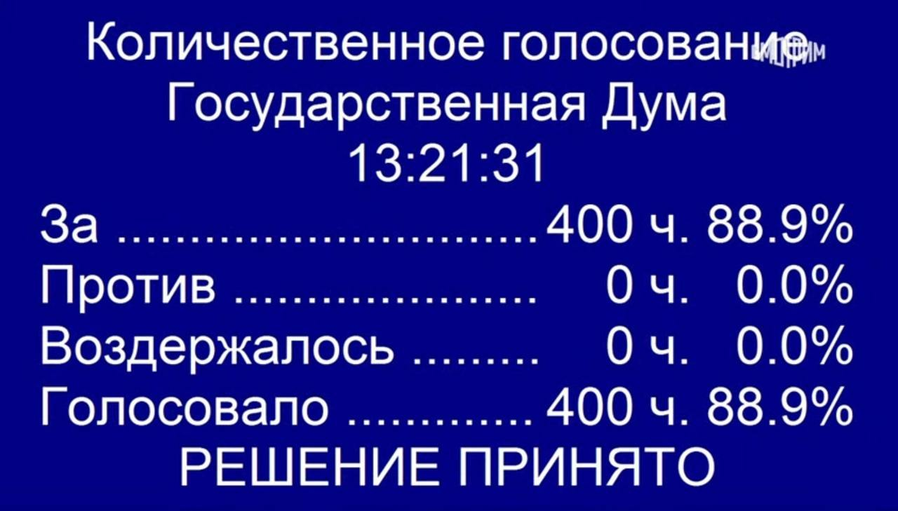

### Голосователь

«Голосователь» — это небольшой инструмент для созыва Государственной Думы Российской Федерации по действительно важным вопросам.

Вы можете вынести на голосование какое-нибудь серьёзное решение (например, стоит ли выпить сегодня пива), а депутаты проголосуют сердцем.

На выходе вы получите результаты — такие же, как и те, что транслируются в здании парламента:

